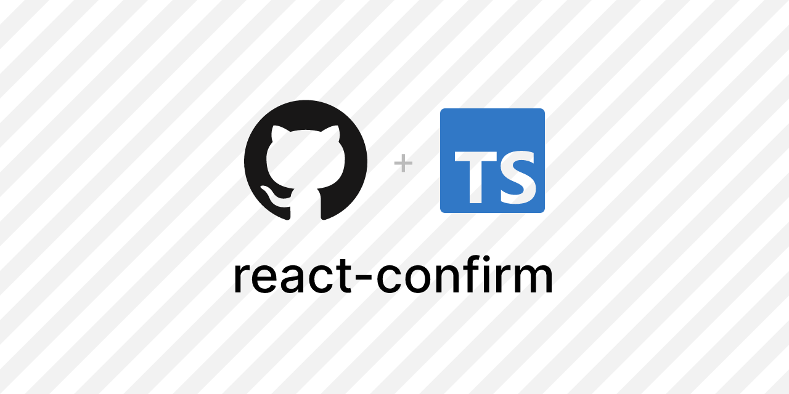

# @razmisoft/react-confirm

A beautiful, flexible, and fully-featured confirmation dialog component for React applications. Built with TypeScript, Tailwind CSS, and Radix UI for maximum flexibility and accessibility.


[//]: # ""



## Table of Contents

- [Installation](#installation)
- [Usage](#usage)
- [API Reference](#api-reference)
- [License](#license)
- [Author](#author)
- [Contributors](#contributors)

## Installation

Using npm:

```bash
npm install @razmisoft/react-confirm
```

Using yarn:

```bash
yarn add @razmisoft/react-confirm
```

Using pnpm:

```bash
pnpm add @razmisoft/react-confirm
```

## Usage

Import CSS for `@razmisoft/react-confirm` at the root of your application:

```tsx
import "@razmisoft/react-confirm/styles.css";
```

### Using Global Provider

Wrap your app with `ConfirmProvider`:

```tsx
import { ConfirmProvider } from "@razmisoft/react-confirm";

function App() {
  return (
    <ConfirmProvider>
      <YourApp />
    </ConfirmProvider>
  );
}
```

Use the `useConfirm` hook anywhere in your app:

```tsx
import { useConfirm } from "@razmisoft/react-confirm";

function DeleteButton() {
  const { confirm } = useConfirm();

  return (
    <button
      onClick={() =>
        confirm({
          title: "Delete Item",
          description: "Are you sure you want to delete this item?",
          onConfirm: () => {
            // Delete the item
          },
        })
      }
    >
      Delete
    </button>
  );
}
```

### Using Dialog Component

You can create and manage your own dialog component:

```tsx
import {
  Dialog,
  DialogContent,
  DialogHeader,
  DialogTitle,
  DialogDescription,
  DialogFooter,
  type ConfirmDialogProps,
} from "@razmisoft/react-confirm";

function CustomDialog({
  open,
  onOpenChange,
  onConfirm,
  onCancel,
  title = "Confirm Action",
  description,
  confirmText = "Confirm",
  cancelText = "Cancel",
  icon,
  variant = "default",
}: ConfirmDialogProps) {
  const [isLoading, setIsLoading] = useState(false);
  const [error, setError] = useState<string>();
  const [success, setSuccess] = useState<string>();

  // Reset state when dialog opens/closes
  useEffect(() => {
    if (!open) {
      setIsLoading(false);
      setError(undefined);
      setSuccess(undefined);
    }
  }, [open]);

  const handleConfirm = async () => {
    setIsLoading(true);
    setError(undefined);
    setSuccess(undefined);

    try {
      await onConfirm();
      setSuccess("Operation completed successfully");
      setTimeout(() => onOpenChange(false), 1500);
    } catch (err) {
      setError(err instanceof Error ? err.message : "An error occurred");
    } finally {
      setIsLoading(false);
    }
  };

  const getStatusIcon = () => {
    if (isLoading)
      return (
        <LoaderIcon className="animate-spin text-blue-600" aria-hidden="true" />
      );
    if (error) return <XIcon className="text-red-600" aria-hidden="true" />;
    if (success)
      return <CheckIcon className="text-green-600" aria-hidden="true" />;
    return (
      icon || (
        <AlertTriangleIcon className="text-yellow-600" aria-hidden="true" />
      )
    );
  };

  return (
    <Dialog open={open} onOpenChange={onOpenChange}>
      <DialogContent>
        <DialogHeader>
          <div className="mx-auto flex h-12 w-12 items-center justify-center rounded-full bg-slate-100">
            {getStatusIcon()}
          </div>
          <DialogTitle className="text-center">{title}</DialogTitle>
          {description && !error && !success && (
            <DialogDescription className="text-center">
              {description}
            </DialogDescription>
          )}
          {error && (
            <DialogDescription className="text-center text-red-600">
              {error}
            </DialogDescription>
          )}
          {success && (
            <DialogDescription className="text-center text-green-600">
              {success}
            </DialogDescription>
          )}
        </DialogHeader>
        <DialogFooter className="sm:justify-center">
          <Button variant="outline" onClick={onCancel} disabled={isLoading}>
            {cancelText}
          </Button>
          <Button
            variant={variant}
            onClick={handleConfirm}
            loading={isLoading}
            loadingText="Loading..."
            disabled={isLoading}
          >
            {confirmText}
          </Button>
        </DialogFooter>
      </DialogContent>
    </Dialog>
  );
}
```

## API Reference

### `ConfirmProvider`

The `ConfirmProvider` component provides wraps your app with a context provider and adds a `ConfirmDialog` component to the root of the app. It accepts the following props:

```tsx
interface ConfirmProviderProps {
  children: React.ReactNode;
}
```

### `useConfirm`

The `useConfirm` hook provides is used to show a confirmation dialog. It returns an object with the following functions:

- `confirm`: A function that shows a confirmation dialog. It accepts the following props:

  ```tsx
  interface ConfirmOptions {
    title?: string;
    description?: string;
    confirmText?: string;
    cancelText?: string;
    onConfirm: () => Promise<void>;
    onCancel?: () => void;
  }
  ```

- `updateDialog`: A function that updates the dialog content. It accepts the following props:

  ```tsx
  interface UpdateDialogOptions {
    title?: string;
    description?: string;
    confirmText?: string;
    cancelText?: string;
  }
  ```

- `closeDialog`: A function that closes the dialog.

`confirm` and `updateDialog` functions accept `DialogOptions` object with the following properties:

```tsx
interface DialogOptions {
  title?: string;
  description?: string;
  confirmText?: string;
  cancelText?: string;
  icon?: React.ReactNode;
  variant?: "default" | "destructive";
  onConfirm?: () => Promise<void>;
}
```

### `Async Operations`

The `onConfirm` function passed to the `confirm` function should return a promise. The dialog will show a loading spinner until the promise is resolved or rejected.

### `ConfirmDialog`

A fully customizable dialog component that can be used to show confirmation dialogs. It accepts the following props:

```tsx
interface ConfirmDialogProps {
  open: boolean;
  onOpenChange: (open: boolean) => void;
  onConfirm: () => Promise<void>;
  onCancel: () => void;
  title?: string;
  description?: string;
  confirmText?: string;
  cancelText?: string;
  icon?: React.ReactNode;
  variant?: "default" | "destructive";
}
```

When you wrap your app with `ConfirmProvider`, a `ConfirmDialog` component is added to the root of the app. You don't need to use this component directly unless you want to create a custom dialog component.

### `useConfirmation`

The `useConfirmation` hook is used to show a confirmation dialog. It returns an object with the following functions:

- `confirm`: A function that shows a confirmation dialog. It accepts the following props:

  ```tsx
    interface ConfirmOptions IUseConfirmation {
        isOpen: boolean;
        options: DialogOptions;
        confirm: (options?: ConfirmationOptions) => Promise<boolean>;
        updateDialog: (options: Partial<DialogOptions>) => void;
        handleConfirm: () => Promise<void>;
        handleCancel: () => void;
    }
  ```

  If you are using a custom dialog component and want to manage the dialog state yourself, you can use this hook since it extracts the dialog state management logic.

## Best Practices

1. **Global vs Local Dialogs**

- Use `useConfirm` for app-wide confirmations
- Use `useConfirmation` with custom UI for localized dialogs

2. **Error Handling**

- Always handle async operations in `onConfirm`
- Use try/catch blocks for error states

3. **Accessibility**

- Provide descriptive titles and descriptions
- Use appropriate ARIA labels
- Ensure keyboard navigation works

4. **UI/UX Guidelines**

- Use appropriate variants for different actions
- Keep descriptions clear and concise
- Show loading states during async operations

## License

MIT © [sadamkhan7679](https://github.com/sadamkhan7679)

## Author

sadamkhan7679 (https://github.com/sadamkhan7679)

## Contributors

- [List of contributors](https://github.com/razmisoft/react-confirm/graphs/contributors)

Want to contribute? Check out our [Contributing Guide](CONTRIBUTING.md).
